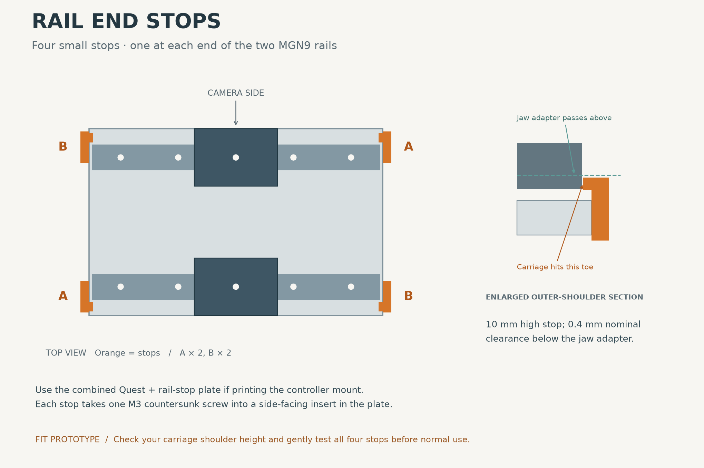

# Rail end stops

Four small printed stops for the two 100 mm MGN9 rails in tinyumi. Each stop
bolts to an end face of the printed plate and catches the outer shoulder of a
carriage. The top stays below the moving jaw adapter.

## Print these

- **`rail_stops_four_flat.3mf`**: recommended; four separately named objects,
  broad mounting faces flat on the bed, 8 mm gaps and matching A/B diagonals.
  This is a geometry-only 3MF; select your printer and PETG profile in the slicer.
- `rail_stops_four_on_plate.stl`: the same corrected arrangement as one STL.
  This file replaces the earlier upright print layout.
- Individual parts: `rail_stop_A_print_2.stl` and `rail_stop_B_print_2.stl`.
  Print two of each; use A on one diagonal pair of corners, B on the other.
- **`plate_v6_quest_and_rail_stops.stl`**: use this replacement plate for the
  Quest mount plus these stops. It includes both sets of insert holes.
- `plate_v6_with_rail_stops.stl`: alternative plate for the stops alone.

Editable STEP files accompany each part. `build.py` generates the geometry,
placement drawing and checks; `validation.json` records their results.

**The existing plate has no side-facing holes for these stops.** Print the
appropriate revised plate. Both the stock plate and the earlier Quest-only
plate need this revision to accept the stops as drawn. The rails stay standard.

## Hardware and assembly

Per gripper, add four M3 x 5 mm heat-set inserts with nominal 4 mm OD and four
M3 x 8 mm, 90-degree countersunk screws. These are additional to the two screws
and inserts used by the Quest support.

1. Print the stops in PETG, approximately 0.2 mm layers and four walls. The
   individual stop STLs and four-part layout now sit broad-face down on Z=0,
   4.5 mm high, with vertical screw holes and countersinks facing the bed.
   See `rail_stops_print_layout.png`. Print settings are a starting
   point, not experimentally verified settings.
2. Fit the four inserts into the **narrow end faces** of the new plate, with the
   insert axes parallel to the rails. Nominal centres are x=±51, y=±24.5,
   z=3 mm in the plate frame; bores are 4 mm diameter and 5.4 mm deep. Check your
   insert's actual knurl diameter before fitting. There is only 1 mm nominal
   wall above and below each bore, so avoid overheating the pocket.
3. Bolt one stop at each corner using the A/B arrangement shown above. The small
   raised toe points inward along the rail and sits on the outside shoulder of
   its carriage. Seat screws without crushing or twisting the printed stop.
4. Gently slide each carriage toward each stop. It must contact the toe while
   remaining fully on the rail. Check that the carriage cannot lift, bypass or
   rotate the stop. Then sweep the gripper through its intended opening range.

Keep a temporary restraint at the rail ends until all four stops have passed
that check. These are stops for hand-operated travel, not crash bumpers.

## Geometry and checks

The stop face is at x=±49.5 mm, 0.5 mm inboard of the nominal 100 mm rail ends.
The toe spans z=7.8–10.0 mm; the adapter CAD starts at z=10.4 mm, leaving 0.4 mm
nominal vertical clearance. All stop material lies outside |y|=20.5 mm, clear
of the reference finger-holder envelope by about 0.48 mm. These are small
nominal clearances and require checking against the printed assembly.

Nominal MGN9C dimensions from the [HIWIN catalogue](https://www.hiwin.com/wp-content/uploads/HIWIN-Linear-Guideway-Catalog.pdf)
are rail width 9 mm, rail height 6.5 mm, carriage width 20 mm, carriage length
28.9 mm and carriage underside height 2 mm above the mounting surface. With
the rail mounted on the plate's z=6 mm face, the outer carriage shoulder begins
at z=8 mm and meets the toe. Clone carriages can differ: **verify that your
carriage actually has a shoulder in the z=7.8–10.0 mm band.**

For that nominal block, the stop gives approximately ±35.05 mm of carriage-centre
travel, a total 70.1 mm. This is carriage travel, not gripper aperture. The
existing assembly GLB uses a simplified carriage envelope; this contact check
uses the catalogue dimensions rather than treating that envelope as supplier CAD.

Checks run: valid single CAD solids, watertight stop and plate STLs, no stop/plate
or stop/rail intersection, nominal carriage contact before the rail end, and
adapter/finger-holder clearance. Actual clone dimensions, physical full-stroke
operation, screw fit, impact resistance and retention remain untested.
