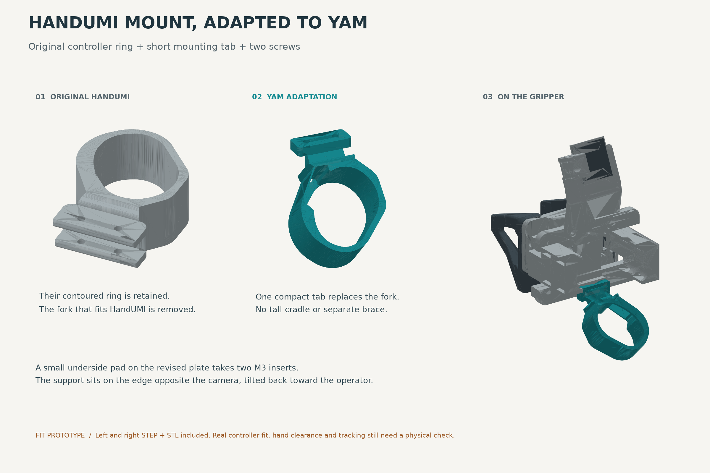

# HandUMI controller support adapted for tinyumi

This replaces the earlier tall-cradle concept. The controller rings come from
HandUMI's actual left and right STEP files. Their mounting forks are trimmed
and replaced with short angled tabs. One support attaches with two screws.

## Files

- `handumi_yam_right_support.step` / `.stl`: adapted right support.
- `handumi_yam_left_support.step` / `.stl`: adapted left support.
- `plate_v6_handumi_mount.step` / `.stl`: revised stationary plate, used with
  either support. **This support needs the revised plate; it does not bolt onto
  an unmodified plate_v6.**
  If your rails lack end stops, use the
  [combined Quest + rail-stop plate](../../../hardware/rail_stops/README.md)
  instead; it also accepts the four printed rail stops.
- `yam_with_handumi_mount.glb`: assembly preview, in metres. Other assembly
  components come from the existing illustration and include simplified parts.
- `build.py`: repeatable CAD modification, export, rendering and checks.
- `validation.json`: geometric results and remaining physical checks.
- `source/`: pinned, unmodified upstream supports and Apache-2.0 licence.

## What changed

The original contoured rings and their existing retention features are retained.
The HandUMI-specific fork attachment is replaced by a small two-hole tab and
short neck. The ring is tilted 45 degrees back toward the operator, on the edge
opposite the camera. There is no tall cradle, additional cage or separate brace.
The left and right sources are distinct parts, not assumed mirror copies.

The revised plate adds a 30 x 12 x 4 mm pad on its underside, centred at
(0, -26.5) mm in the original plate frame. Two insert bores are centred at
(±8, -28) mm: 16 mm pitch, nominal 4 mm bore diameter and 5.4 mm depth from the
pad underside. Material above z=2 mm is unchanged, retaining the original rail,
pinion and camera geometry. Existing rail or camera screws are not repurposed.

The support tab is 5 mm thick with 3.4 mm clearance holes and 6.4 mm countersink
mouths. Start with two M3 x 5 mm heat-set inserts, OD 4 mm, and two M3 x 10 mm
90-degree countersunk screws. Verify the actual insert fit and screw engagement
before assembly; insert knurl specifications vary. The tab meets the underside
pad at z=-4 mm. The source CAD units and all exported STEP/STL units are mm.

## Fit prototype, not a tested release

The support and plate are valid single solids with watertight meshes. The build
checks support/plate interference and conservative bounding-box clearance against
the existing assembly. Moving-part X bounds are expanded over the plate width
to check lateral jaw travel; this is a geometry screening check, not a dynamic
simulation or a measured assembly fit.

**The upstream files do not establish a physically verified Touch Plus fit for
your particular controllers.** Their original controller contact geometry is
preserved rather than replaced with the guessed ellipse from the first concept.
Try the appropriate ring on your Quest 3 / 3S controller before printing the
replacement plate. Do not force it on or sand away a locating surface without
checking tracking and repeatability again.

Check the real controller body, buttons, tracking surfaces, hand, wrist, straps
and USB cable in the mounted position. Those are not modelled in the assembly
clearance check. In particular, the controller body can occupy space beyond the
printed ring. Use a loose safety tether during trials and confirm the controller
cannot slide or rotate in the ring. Tracking accuracy and print strength have
not been tested. Keep the original camera and aperture-marker setup.

For prototype printing, PETG matches the existing build. Orient the support in
the slicer with the neck load path in mind and inspect required supports; the
STLs retain assembly coordinates, not a prescribed print orientation. Check
insert fit on a small coupon first.

## Provenance and licence

Modified from [murobotics-ai/handumi-hw](https://github.com/murobotics-ai/handumi-hw)
at commit `fc7462ad1ed58c0c8538f6c7dbb732211d088ca8`:

- `hardware/STEP/right_handumi/right_controller_support.step`
- `hardware/STEP/left_handumi/left_controller_support.step`

The upstream parts and derived supports are distributed under Apache-2.0; see
[source/LICENSE](source/LICENSE). Modifications made 2026-09-12: removed the
original fork mounting ends, transformed ring placement, added YAM mounting
tabs, and created the associated plate interface. Original source STEP files
are retained unmodified, with SHA-256 hashes in `validation.json`.

The plate derives from this repository's `hardware/STEP/plate_v6.step`. Assembly
illustrations also use the repository's existing I2RT-derived tip meshes; see
the root `THIRD_PARTY_NOTICES.md` for their provenance.
